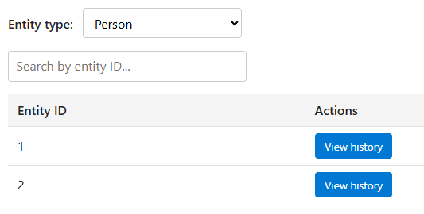
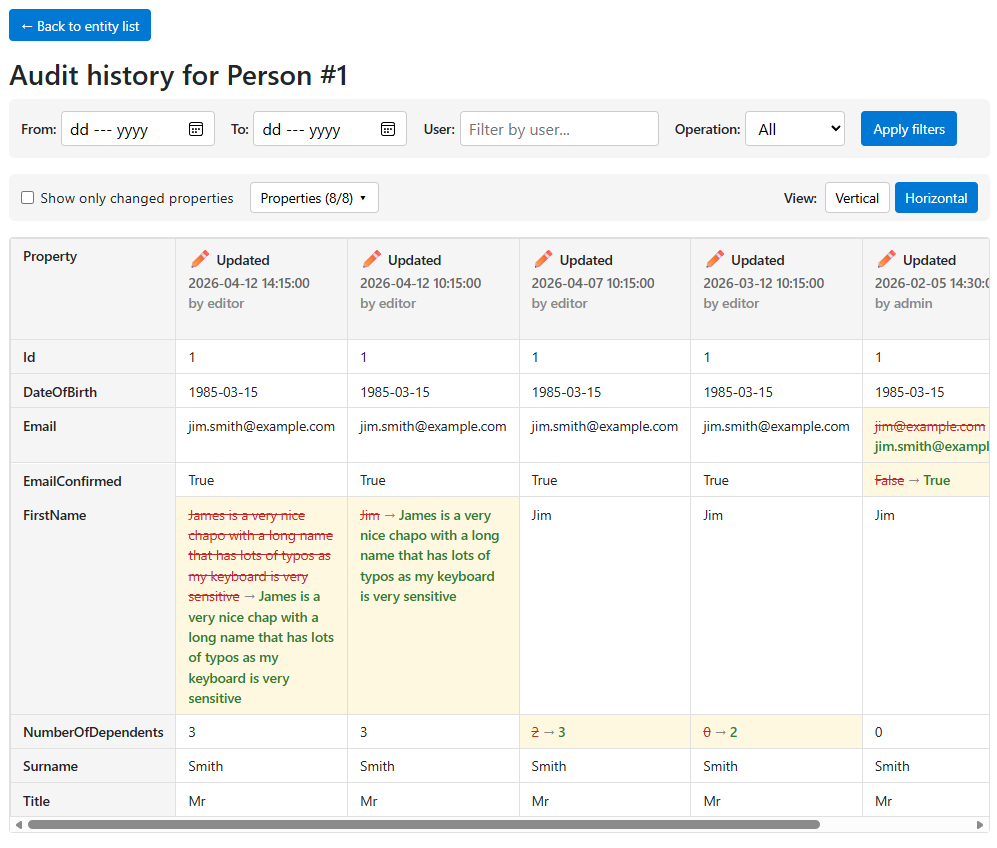
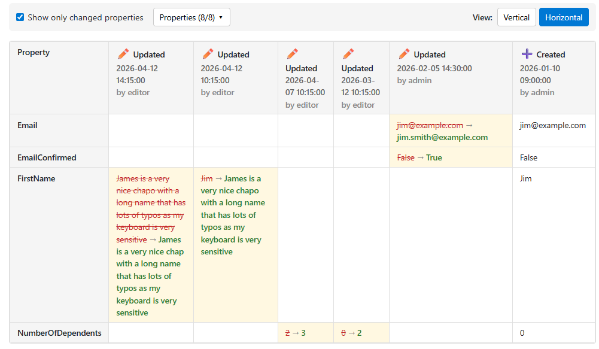
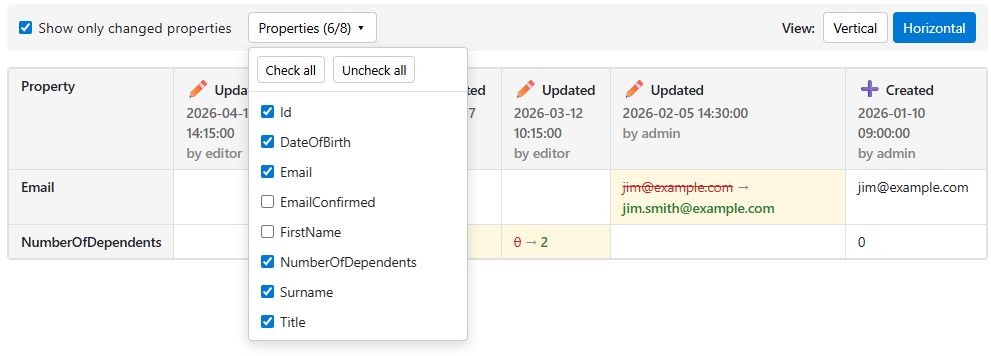
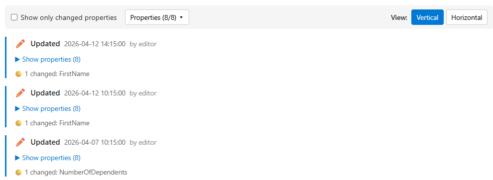
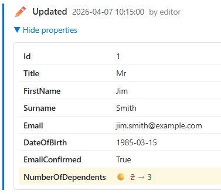
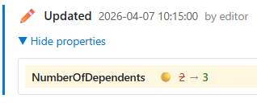

# Audit viewer

In order to ease the pain of auditing database changes, I have added features to the repo to make this easier.

To configure auditing, you need to add a reference to both the `Pixata.AspNetCore` packkkage (version >= 1.4.0) and the `Pixata.Blazor` package (version >= 2.24.0).

## Configuring auditing
Then add the following to your `DbContext`...

```csharp
public virtual DbSet<Audit> Audits { get; set; } = null!;
```

You'll need a `using` for `Pixata.AspNetCore.Auditing.Models`. Add a migration and update your database to create the audit table.

Then, in the `Program.cs` of your Blazor app (server project), add auditing, and a call to `AddAuditingInterceptor` as follows...

```csharp
builder.Services.AddAuditing<AppDbContext>();
builder.Services.AddDbContext<AppDbContext>((serviceProvider, options) => {
  options.UseSqlServer(builder.Configuration.GetConnectionString("DefaultConnection"))
    .AddAuditingInterceptor(serviceProvider));
  // Any other options you normally use
}, ServiceLifetime.Transient);
```

That's basically all you need to have auditing information recorded when entities are added, modified or deleted.

### Excluding entities from being audited
If there are any entities that you don't want audited, you can add the `[NoAudit]` attribute to them, and they will not be audited...

```csharp
[NoAudit]
public class EntityThatWillNotBeAudited {
  // Entity properties
}
```

### Manually setting the user
If there is an authorised user when the entity is saved, their user name will be recorded in the audit information. If you want to provide a custom user name, you can inject an instance of `AuditUserContextInterface` and set the user name. For example, if you have an API endpoint that can be called anonymously, you could do the following...

```csharp
app.MapGet("/my-endpoint", (AuditUserContextInterface auditUserContext) =>
  auditUserContext.UserIdentifier = "My endpoint";
  // Usual code here
);
```

In this case, the audit item will show "My endpoint" as the user name.

### Retention
By default, audit information is retained indefinitely. You can configure a retention period and cleanup interval as follows...

```csharp
builder.Services.AddAuditing<AppDbContext>(options => {
  options.RetentionPeriod = TimeSpan.FromDays(90);
  options.CleanupInterval = TimeSpan.FromHours(6); // default: daily
});
```

If you configure a policy, then a background service will run at the configured interval and delete any audit records that are older than the retention period.

## Using the audit viewer
To view audit information, you can use the `AuditViewer` component. Basic usage only requires you to specify the `DbContext` type as follows...

```xml
<AuditViewer TContext="AppDbContext" />
```

When you navigate to a page containing this component, you will see a dropdown containing the names of all entities that are being audited...



You can change the type of entity being displayed from the dropdown, and can search for a specific entity by typing its Id in the tetxbox.

Click the blue button to see audit entries for the entity...



The filters at the top allow you to narrow down the results.

The "Show only changed properties" checkbox will only show properties that were changed at some point...



The "Properties" dropdown allows you to choose which properties are displayed, making it easier to track changes over a few selected ones...



The View buttons change the way the entries are displayed. By default, the audit entries are displayed side-by-side, with the newest on the left. If you change to Vertical view, the entries are listed down the page...



Clicking a "Show properties" link will expand the entry to show the changes...



Checking the "Show only changed properties" checkbox works here too...



You can set the default entity type to be displayed and the default view in the component markup...

```xml
<AuditViewer TContext="SampleDbContext" 
             DefaultEntityType="Person" 
             DefaultHorizontalView="false" />
```

If `DefaultEntityType` is not set, then the viewer will show the first entity type (alphabetically).

`DefaultHorizontalView` is `true` by default.