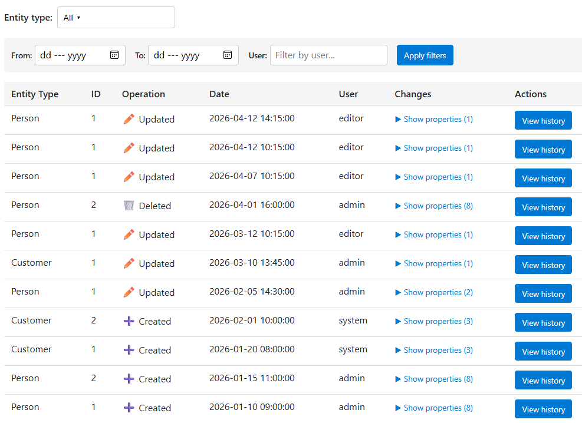
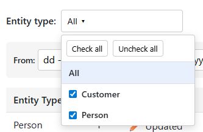
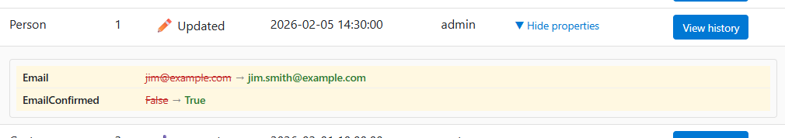
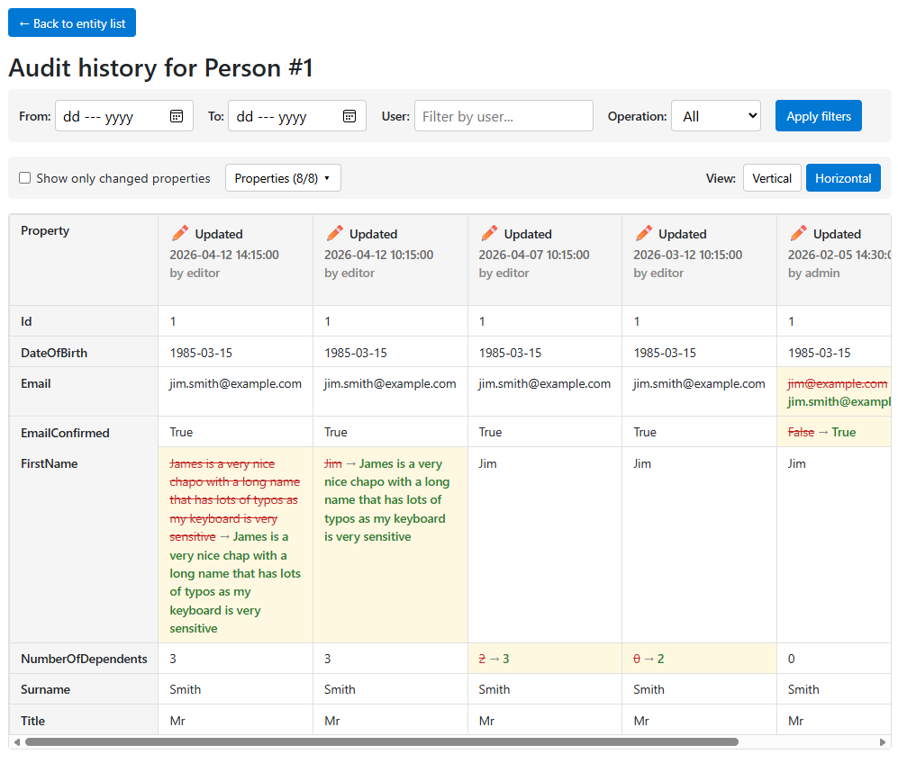
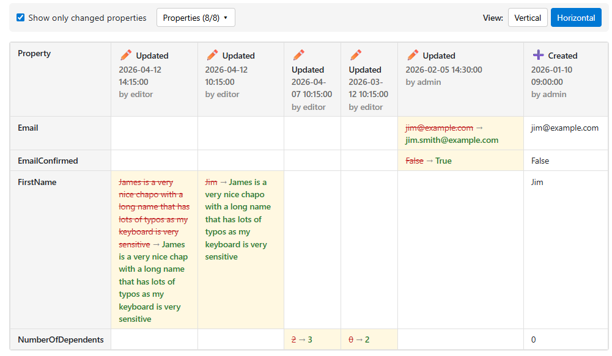
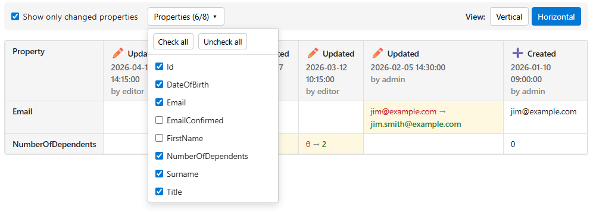
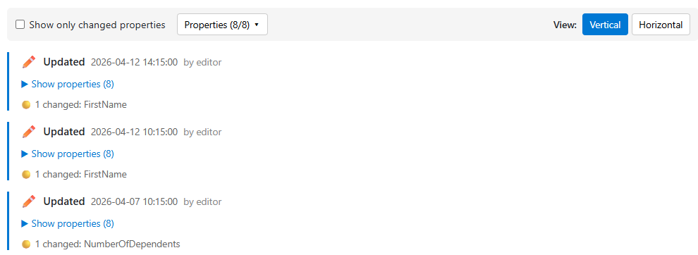
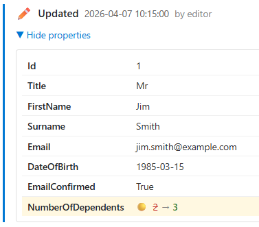
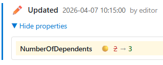

# Audit viewer

>Part of [Pixata.Blazor](Readme.md)

The `AuditViewer` component browses the audit trail recorded by the auditing feature, so you can see what changed on an entity, when, and who changed it.

The feature spans three packages. The models live in `Pixata.Extensions`, the EF Core interceptor that records the changes lives in `Pixata.AspNetCore`, and the component that displays them lives here. For the recording half - the interceptor, the `[NoAudit]` attribute, identifying the user and the retention policy - see the [auditing documentation](https://github.com/MrYossu/Pixata.Utilities/blob/master/Pixata.AspNetCore/Readme.Auditing.md) in the Pixata.AspNetCore package.

You will need these package versions or later...

- `Pixata.Extensions` 2.7.0
- `Pixata.AspNetCore` 1.5.0
- `Pixata.Blazor` 2.25.0

## Registering the viewer's service

The component talks to `AuditViewerServiceInterface`, and which implementation you register depends on where the component runs.

### Server-side apps

The component can reach the database directly, so register the server-side implementation in `Program.cs`...

```csharp
builder.Services.AddPixataAuditViewer();
```

You'll need `using Pixata.AspNetCore.Auditing.Extensions;`.

>**Moved.** As of Pixata.Blazor v4.0.0, `AddPixataAuditViewer()` and the `AuditViewerService` it registers live in the **Pixata.AspNetCore** package rather than in this one. The service needs a `DbContext`, so keeping it here forced EF Core into every client-side app that used any component from this package. The method and its behaviour are otherwise unchanged.
>
>Nothing changes for the client side. The `AuditViewer` component only ever talked to `AuditViewerServiceInterface`, which stays in Pixata.Extensions.

### Mixed-mode and WASM apps

The component runs in the browser, so it needs an API to talk to. In the server project's `Program.cs`, add...

```csharp
app.MapAuditApi("/api/audit");
```

The route can be anything you like.

As this endpoint exposes audit information, you should ensure that it is protected by authentication and authorisation. For example...

```csharp
app.MapAuditApi("/api/audit")
   .RequireAuthorization("AuditViewerPolicy");
```

Then, in the client project's `Program.cs`, add...

```csharp
builder.Services.AddAuditViewerHttpService(builder.HostEnvironment.BaseAddress + "api/audit/");
```

...where the route matches the one you used in the server project.

## Using the audit viewer

To view audit information, add the `AuditViewer` component to any Blazor component...

```xml
<AuditViewer />
```

When you navigate to a page containing this component, you will see a dropdown containing the names of all entities that are being audited. By default "All" is selected, meaning that you see all entities...



The filters at the top allow you to narrow down the results.

The dropdown allows you to select multiple entities...



>Note that if you click on an entity in the dropdown, it will select just that one, and the display will only show the Id. I intend to change this, as it's less than useful, but for now, you just need to remember to click All after selecting your desired entities.

You can click the "Show properties (n)" link to see what changed in that audit entry...



Click the blue button to see all audit entries for the entity...



The "Show only changed properties" checkbox will only show properties that were changed at some point...



The "Properties" dropdown allows you to choose which properties are displayed, making it easier to track changes over a few selected ones...



The View buttons change the way the entries are displayed. By default, the audit entries are displayed side-by-side, with the newest on the left. If you change to Vertical view, the entries are listed down the page...



Clicking a "Show properties" link will expand the entry to show the changes...



Checking the "Show only changed properties" checkbox works here too...



The current view is kept in the query string, so refreshing the page (or sending someone the link) preserves what you were looking at.

## Parameters

```xml
<AuditViewer DefaultEntityType="Person"
             DefaultHorizontalView="false" />
```

| Parameter | Default | What it does |
| --- | --- | --- |
| `DefaultEntityType` | | The entity type to show when the page first loads. If it isn't set, the viewer shows the first entity type alphabetically |
| `DefaultHorizontalView` | `true` | Whether the entries start off side-by-side rather than down the page |
